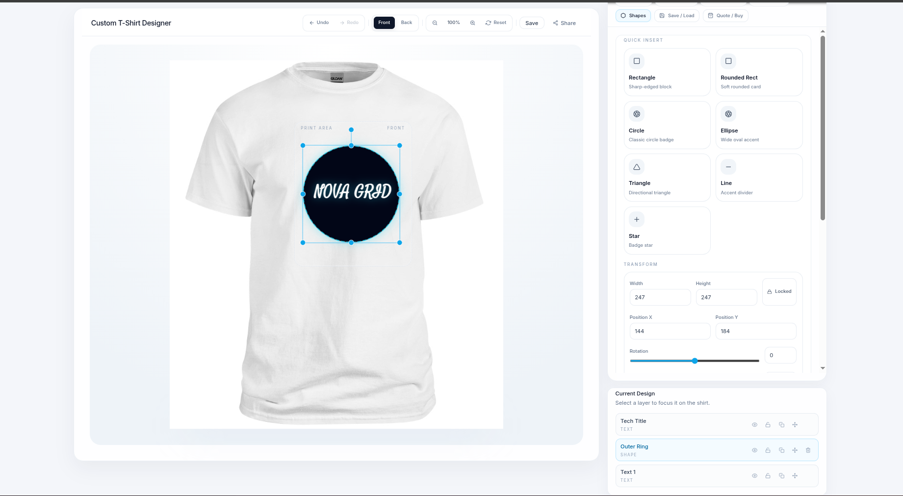
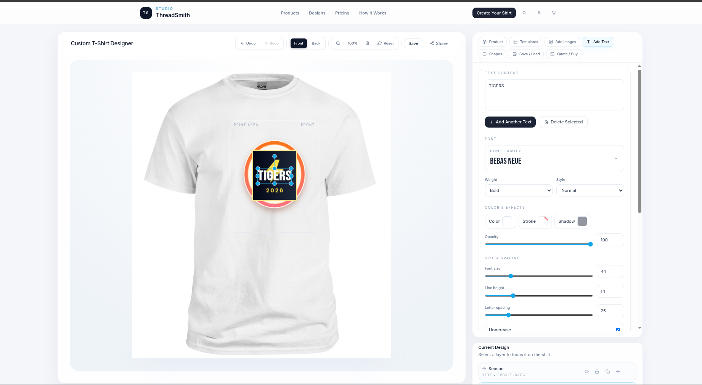

# PrintForge

An UberPrints-style design studio built with React, TypeScript, Tailwind, and Fabric.js.

PrintForge is a browser-based apparel editor focused on fast customization, rich template rendering, and a scalable template engine for premium print-ready designs.

## Preview

> Add your screenshots to `docs/screenshots/` and update the paths below when you're ready.




## Why This Project

Most web-to-print editors feel functional, but not inspiring. PrintForge is being shaped as a more modern design studio experience:

- polished shirt preview stage
- side-aware editing for front and back
- drag-and-edit canvas powered by Fabric.js
- premium template library with richer styling support
- placeholder-driven quick edits for reusable designs
- future-ready schema for import pipelines and scalable template families

## Current Features

### Editor

- add and edit text, shapes, and images
- reorder, duplicate, lock, hide, and delete layers
- front/back product view switching
- canvas history support
- image adjustments and text styling controls

### Template Engine

- normalized template schema with backward compatibility
- multi-artboard support
- richer text properties:
  stroke, inner stroke schema support, shadow, tracking, horizontal scaling, curved text, warp-ready fields
- richer shape properties:
  gradients, ellipse, line, star, polygon, path support
- richer image/vector properties:
  fit modes, crop metadata, tint hooks, monochrome mode, SVG/vector layers
- placeholders and style tokens for reusable template families
- production-friendly metadata for source, variants, personalization, and scaling

### Demo Templates

- modern sports badge
- premium varsity logo
- retro surf badge
- event flyer print
- minimal monogram logo
- neon tech crest

## Tech Stack

- React 18
- TypeScript
- Fabric.js
- Tailwind CSS
- React Icons
- Create React App

## Project Structure

```text
src/
  components/ui/                  shared UI building blocks
  features/editor/                canvas tools, stage, controls, Fabric integration
  features/product/               shirt/mockup presentation
  features/templates_new/
    components/                   template browser and preview UI
    data/                         mock template catalog
    hooks/                        template filtering and apply flows
    types/                        template schema
    utils/                        normalization, preview, rendering helpers
```

## Getting Started

### 1. Install dependencies

```bash
npm install
```

### 2. Start the development server

```bash
npm start
```

Open [http://localhost:3000](http://localhost:3000).

### 3. Create a production build

```bash
npm run build
```

## Environment

If you need local configuration, create a root `.env` file.

Example:

```env
REACT_APP_NAME=PrintForge
```

## Screenshots

Recommended screenshot set for GitHub:

1. full editor layout
2. shirt stage with applied template
3. templates panel grid
4. close-up of text controls
5. before/after premium template examples

Suggested folder layout:

```text
docs/
  screenshots/
    editor-overview.png
    templates-panel.png
    premium-templates.png
```

## Roadmap

- external template import pipelines
- stronger true group editing behavior
- richer vector color replacement controls
- artboard-aware sidebar editing
- production/export improvements
- smarter personalization flows

## Notes

- the app currently uses Create React App
- build output goes to `build/`
- local env files and generated output are ignored in `.gitignore`

## License

Add your preferred license here.
